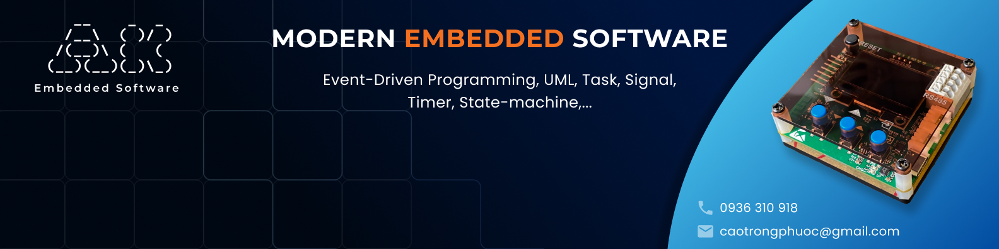

  

## About me

I'm an embedded software engineer specializing in firmware development and event-driven architectures. Currently, I'm developing a game built on the AK Embedded Base Kit and firmware for camera modules. My work focuses on:

- C/C++ firmware development
- Communication protocols (MQTT, HTTP and TLS)
- Event-driven design patterns for real-time embedded systems

## Technologies

- **Languages:** C/C++
- **Frameworks:** AK Embedded Base Kit
- **Protocols:** MQTT, HTTP and TLS
- **Operating Systems:** Linux (Ubuntu)
